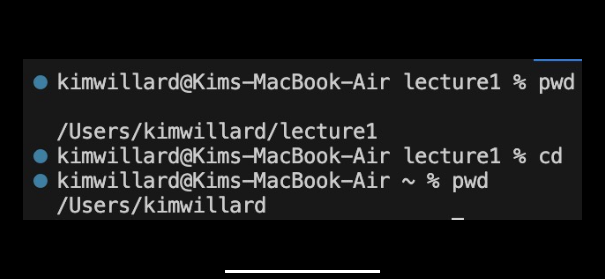
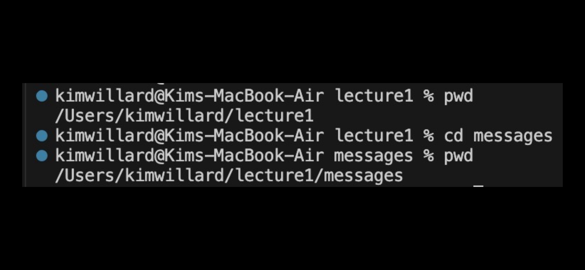
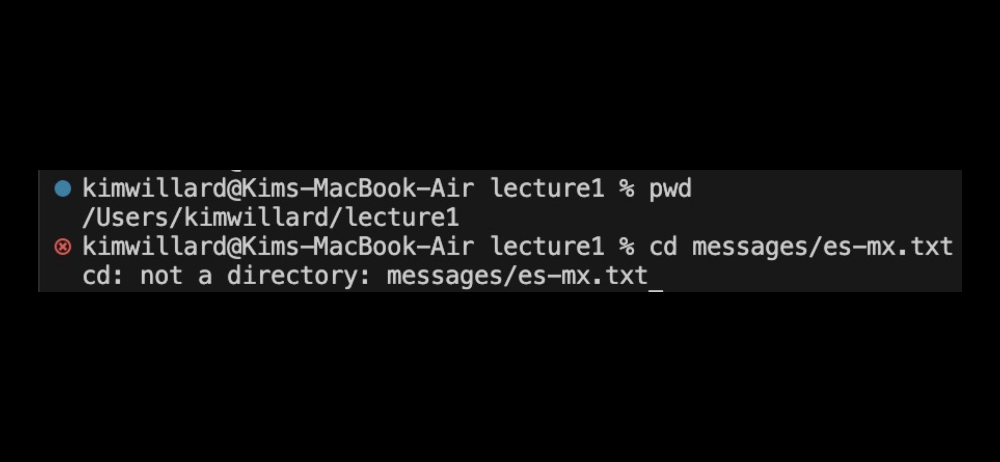
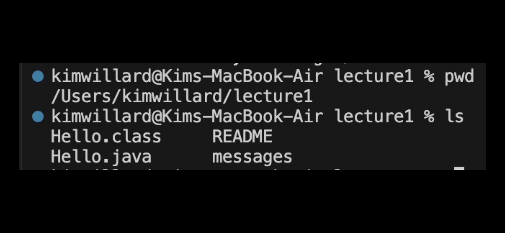
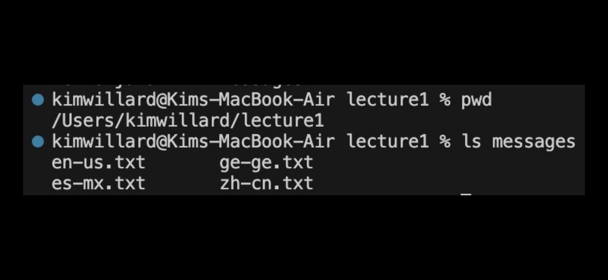
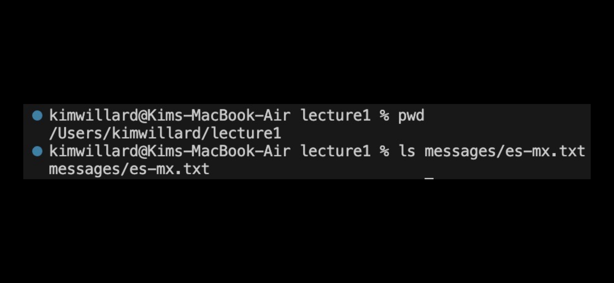
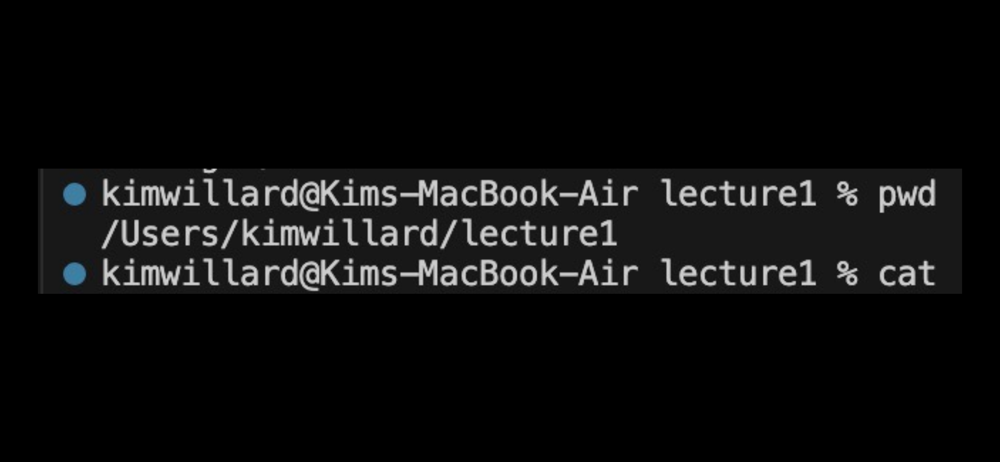
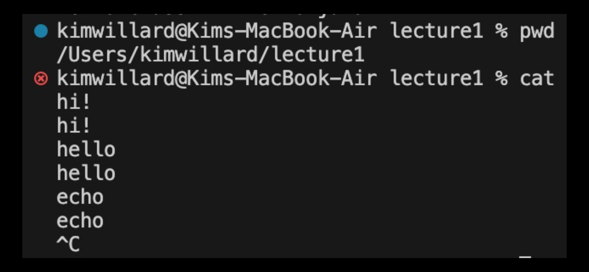
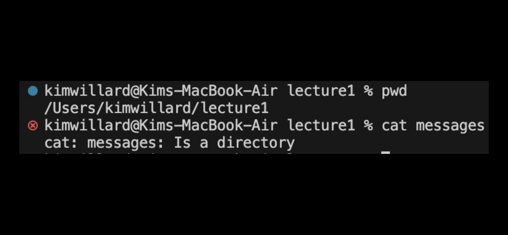
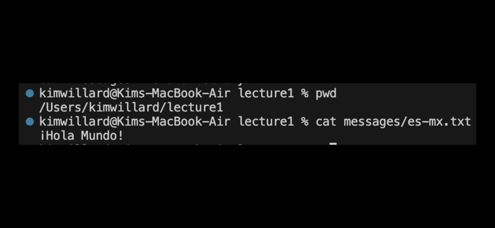

**The absolute path to the working directory was `home/lecture1` before each command was run.
## CHANGE DIRECTORY EXAMPLES (`cd`)- changes the current directory to the directory listed in the argument.

With no argument, `cd` returns back to the home directory. This is because we did not provide a directory to change to. This is not an error. 

Using the path `messages` as the argument, terminal changes the directory to the path leading to `messages`. This is not an error.

This is an *error* because `cd` can only change the directory. It does not have access to files.

## LIST EXAMPLES (`ls`)- shows the files/folders contained in the currrent path

With no argument, terminal shows all of the contents of the current directory, which is `lecture1`. This includes `Hello.class`, `Hello.java`, `README`, and `messages`. This is not an error.

Using `messages` as the directory for the argument, terminal prints all of the files held within `messages`. This is not an error.

Using the file `es-mx.txt` as the argument returns the name of the file back as it does not contain any more files or folders. This is not an error.

## CONCATENATE EXAMPLES (`cat`)- prints contents of file

With no argument, there is no return because there is nothing for terminal to print. This is not an error.

When I type while cat is running, if I press enter it copies exactly what I typed. This is because the purpose of `cat` is to print the content of whatever files you use as an argument-- or in this case, just the text provided. It just show an error because it didn't find any files to print.

There is an *error* because concatenate prints the contents of files, but a directory is not a file.

When using `es-mx.txt` as the argument, terminal prints the contents of the file which is "Hola Mundo!" This is not an error.
