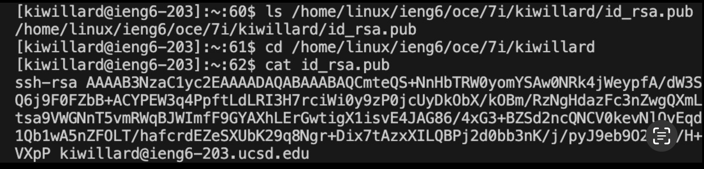
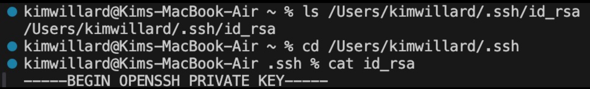
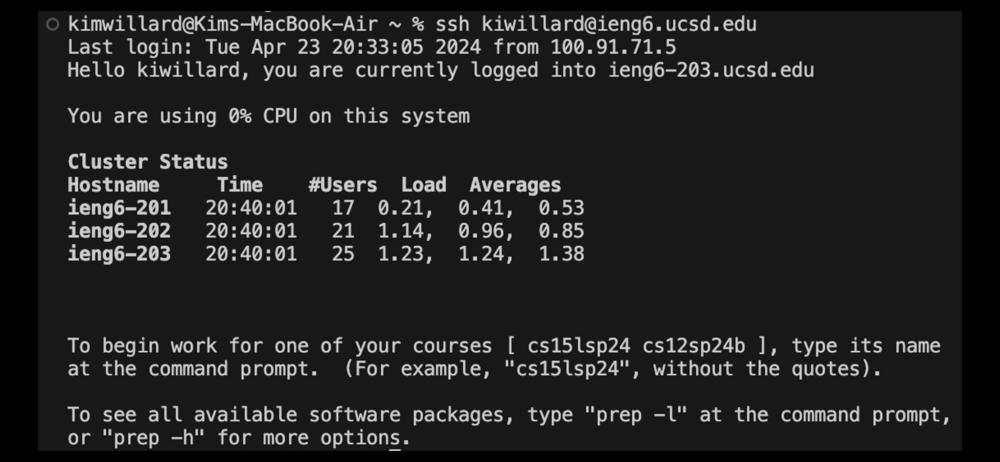

# Lab Report 2
# Part 1
## ChatServer.java Code

***

## Message Example 1
**1st url**

**1st message**

1. Which methods in your code are called?
  * When a second parameter is provided after the server number it runs the method `handleRequest()`
  * When the path includes "/add-message", then the method `getQuery()` is ran
  * If the query is determined to include "s=" and "&user=" then the program runs the `split()` method to seperate the inputs. It also uses the `startsWith()`, `substring()`, `append()`, and `toString()` methods to interpret the parameters.
2. What are the relevant arguments to those methods, and the values of any relevant fields of the class?
* The arguments that the code is specifically checking for follows the outline "/add-message?s=message&user=user" (I didn't include the <>symbols because markdown hides the message)
* Other fields in the class include:
  1. `chatHistory`, which stores the current string displayed on the server. In this case it doesn't store anything, since there was no message displayed before this point.
  2. `query`, which stores all of the arguments beyond the question mark in the arguments. The value stored currently is `s=Hello&user=jpolitz`
  3. `params`, array which stores the message starting with "s=" and the user starting with "user=". Currently it is `{s=Hello, user=jpolitz}`
  4. `message` and `user`, which hold the same as `params` but with "s=" and "user=" removed. Currently it is `{Hello, jpolitz}`
3. How do the values of any relevant fields of the class change from this specific request? If no values got changed, explain why.
* The input following the "/add-message" request changes what is stored in each of the fields.

***
## Message Example 2
**2nd url**

**2nd message**

1. Which methods in your code are called?
  * When a second parameter is provided after the server number it runs the method `handleRequest()`
  * When the path includes "/add-message", then the method `getQuery()` is ran
  * If the query is determined to include "s=" and "&user=" then the program runs the `split()` method to seperate the inputs. It also uses the `startsWith()`, `substring()`, `append()`, and `toString()` methods to interpret the parameters.
2. What are the relevant arguments to those methods, and the values of any relevant fields of the class?
* The arguments that the code is specifically checking for follows the outline "/add-message?s=message&user=user" (I didn't include the <>symbols because markdown hides the message)
* Other fields in the class include:
  1. `chatHistory`, which stores the current string displayed on the server. In this case it stores the message "jpolitz: Hello"
  2. `query`, which stores all of the arguments beyond the question mark in the arguments. The value stored currently is `s=How are you&user=yash`
  3. `params`, array which stores the message starting with "s=" and the user starting with "user=". Currently it is `{s=How are you, user=yash}`
  4. `message` and `user`, which hold the same as `params` but with "s=" and "user=" removed. Currently it is `{How are you, yash}`
3. How do the values of any relevant fields of the class change from this specific request? If no values got changed, explain why.
* The input following the "/add-message" request changes what is stored in each of the fields.

***
# Part 2
## **public key**

The absolute path is /home/linux/ieng6/oce/7i/kiwillard/id_rsa.pub
## **private key**

The absolute path is /Users/kimwillard/.ssh/id_rsa
## Log in to server without password

***
# Part 3
This week I learned about how to connect remotely to another server. This allows me to access files and directories not stored on my computer. I also learned about private and public keys and how they allow me to access servers securely.

