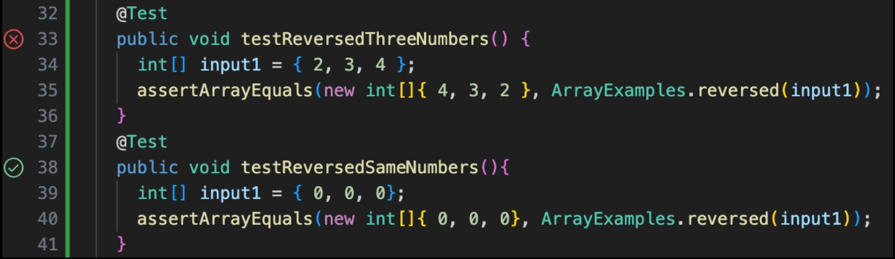
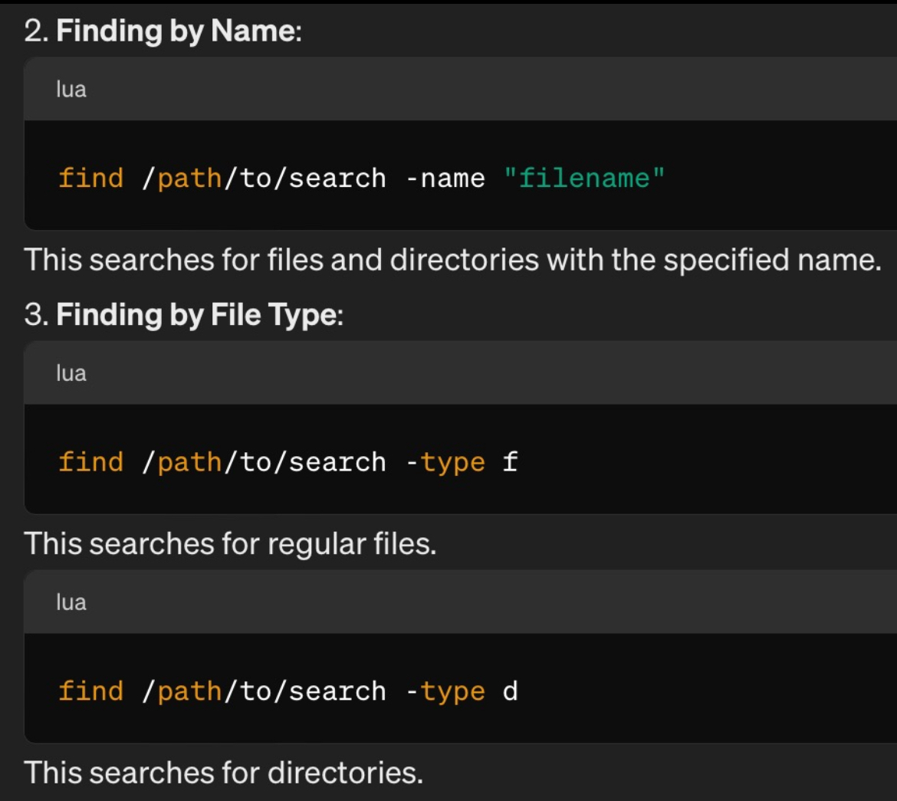
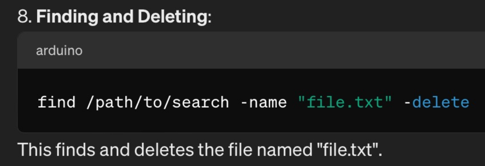
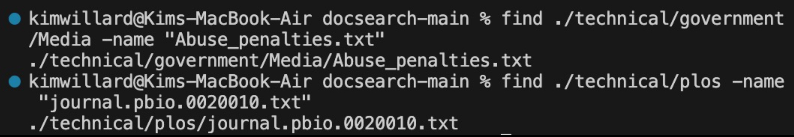
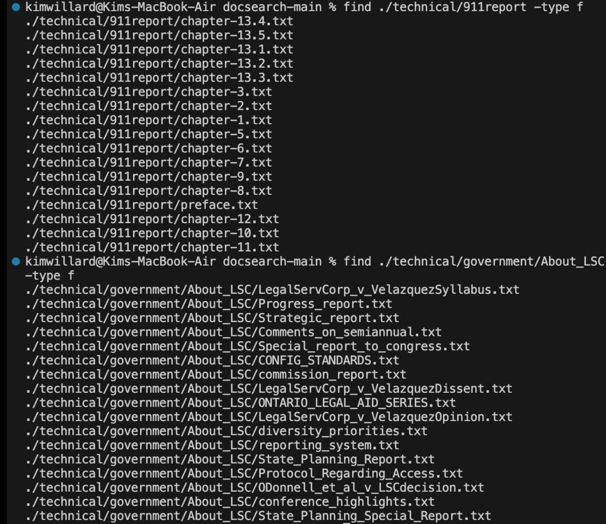
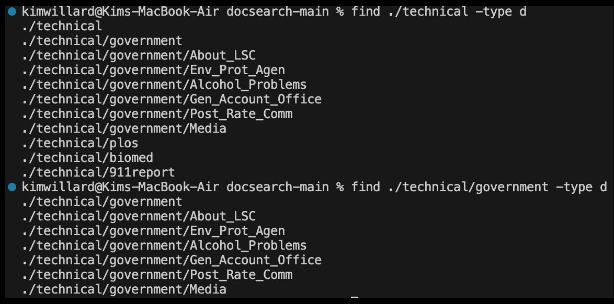
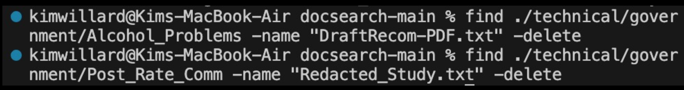

# Part 1- Bugs
There is an error with the `reversed` method in `ArrayExamples.java`.
Here is the original implementation of the method:
```
static int[] reversed(int[] arr) {
    int[] newArray = new int[arr.length];
    for(int i = 0; i < arr.length; i += 1) {
      arr[i] = newArray[arr.length - i - 1];
    }
    return arr;
  }
  ```
In this method, the goal is to take an array `arr` of integers as the argument
and return a new array, with the same values but in reverse order. The code
creates an array field called `newArray` that is of the same length as `arr`.
However, instead of copying the elements of `arr` into the new array, it tries
to copy the elements of `newArray` into `arr`. This doesn't work since the new
array is empty-- hence the output being completely 0s no matter what numbers you
use for the input.
1. Failure & Non-Failure Inducing Input
   
   As of now, the only way to pass the test is to use an array of all 0s for the input.

To fix the issue, the elements of `arr` must be copied into `newArray` in reverse order.
Here is that corrected implementation: 
```
static int[] reversed(int[] arr) {
    int[] newArray = new int[arr.length];
    for(int i = 0; i < arr.length; i += 1) {
      newArray[arr.length - i - 1] = arr[i];
    }
    return newArray;
  }
```
With the correction in the 4th line, the elements of `arr` are copied one-by-one into `newArray`
in the opposite order. Because both arrays have the same length, the elements will fit perfectly into
`newArray`. This version of the method will pass both of the previous JUnit Tests correctly.

# Part 2- Researching Commands
*Sources: I used ChatGPT to learn about the commands for `find`. The prompt that I used said
"What are all of the different ways to use the find command in terminal?" The specific output that I used was the following: 

*
## Command: find
1. `find /path -name "filename"` searches for a file of a certain name
   
   This is helpful to be able to locate a file and verify which directory it belongs to.
3. `find /path -type f` searches for files along path
   
   This command is helpful to quickly express the file contents of a specific path, and the files that are directly inside of it.
5. `find /path -type d` searches for directories along path
   
   This command is helpful to quickly express the directoy contents of a specific path, and the directories that are located inside of it.
7. `find /path -name "filename" -delete` finds and deletes a file
   
   This command allows you to quickly delete a file without having to search through you computer files to locate it first.
