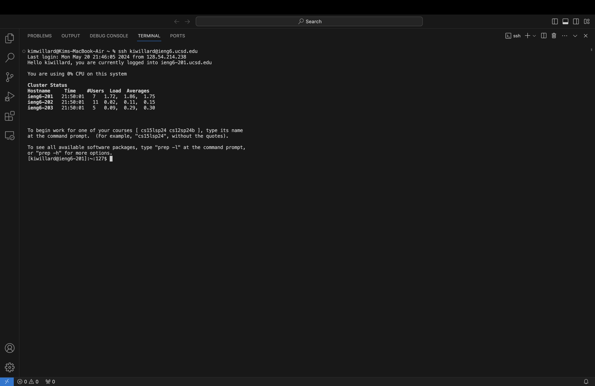
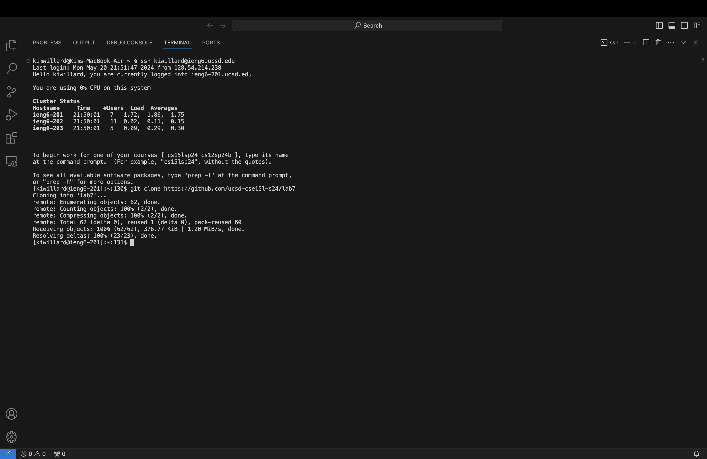
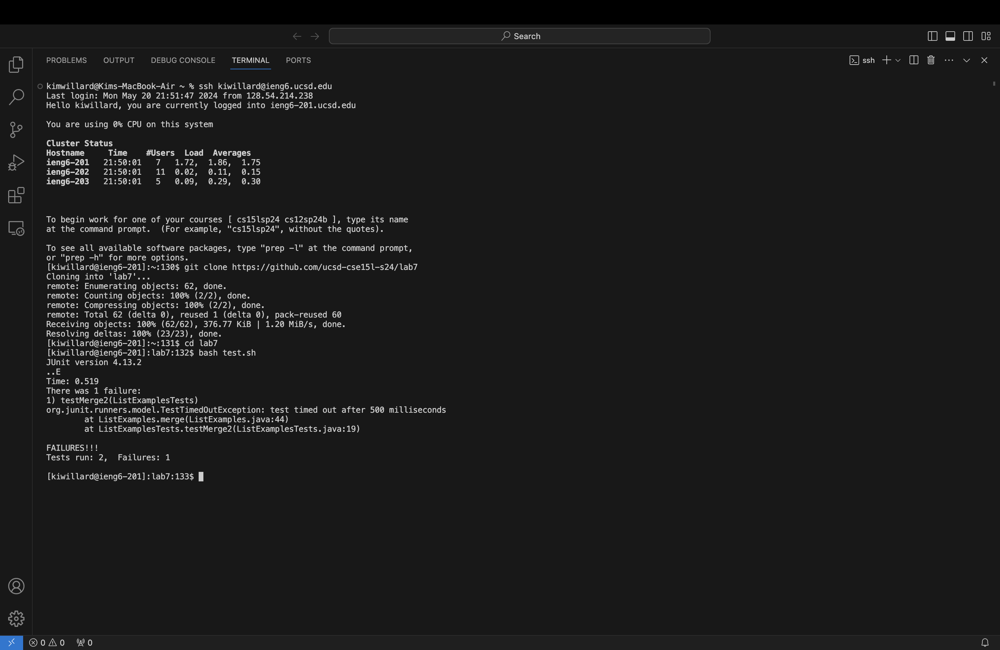
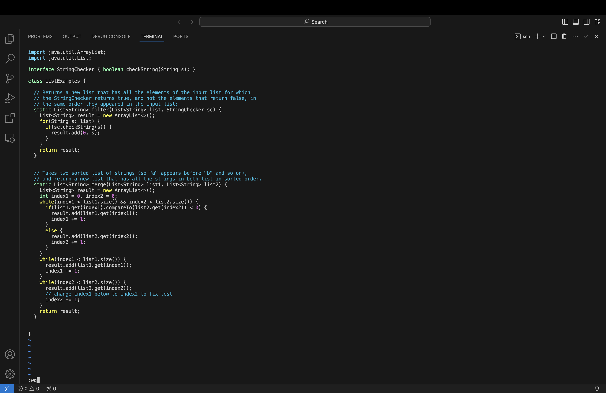
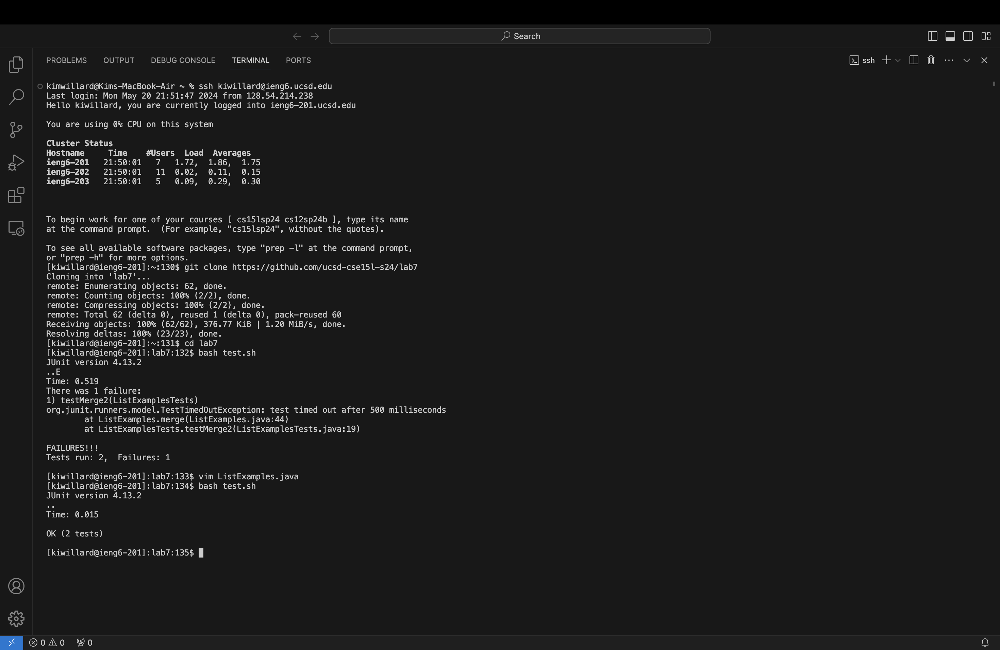
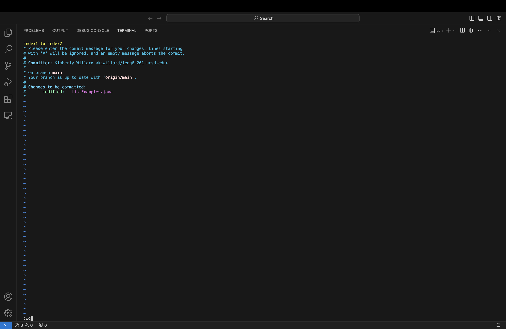
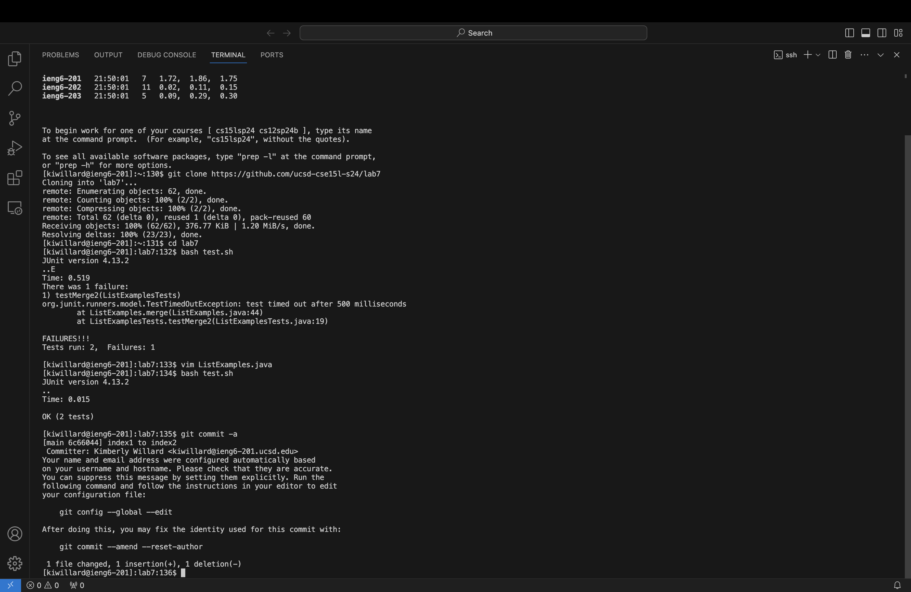

## Lab Report 4

1. Log into ieng6
   
   ```
   "ssh kiwillard@ieng6.ucsd.edu"
   <enter>
   ```
   I typed in my ssh login and pressed enter to log in to ieng.
3. Clone your fork of the repository from your Github account (using the SSH URL)
   
   ```
   "git clone https://github.com/ucsd-cse15l-s24/lab7"
   <enter>
   ```
   I used the clone command to copy the repository onto the computer.
5. Run the tests, demonstrating that they fail
   
   ```
   "cd lab7"
   <enter>
   "bash test.sh"
   <enter>
   ```
   I had to move into the correct directory using the change directory `cd` command.
   Then I used `bash.sh` to run the tests, since it automatically compiles and runs the code.
7. Edit the code file to fix the failing test
   
   ```
   "vim ListExamples.java"
   <enter>
   k k k k k k
   l l l l l l l l l l l
   r
   2
   :wq
   <enter>
   ```
   I opened vim first. The curser started in the bottom left, so I used `k` to navigate up to the correct line and `l` to navigate right to the correct spot.
   I then used `r` to replace the 1, and replaced it with a 2. Then I used `:wq` to save and quit.
9. Run the tests, demonstrating that they now succeed
    
   ```
   "bash test.sh"
   <enter>
   ```
   I used the test script to run the tests again.
11. Commit and push the resulting change to your Github account
    
    
    ```
    "git commit -a"
    <enter>
    i
    "index1 to index2"
    <esc>
    :wq
    ```
    To commit the changes to my files, I used the `commit -a` command which means commit all.
    To write a commit message I pressed `i` to enter insert mode and typed a message. When I was done I pressed `esc` to exit insert mode, and `:wq` to save and quit.
