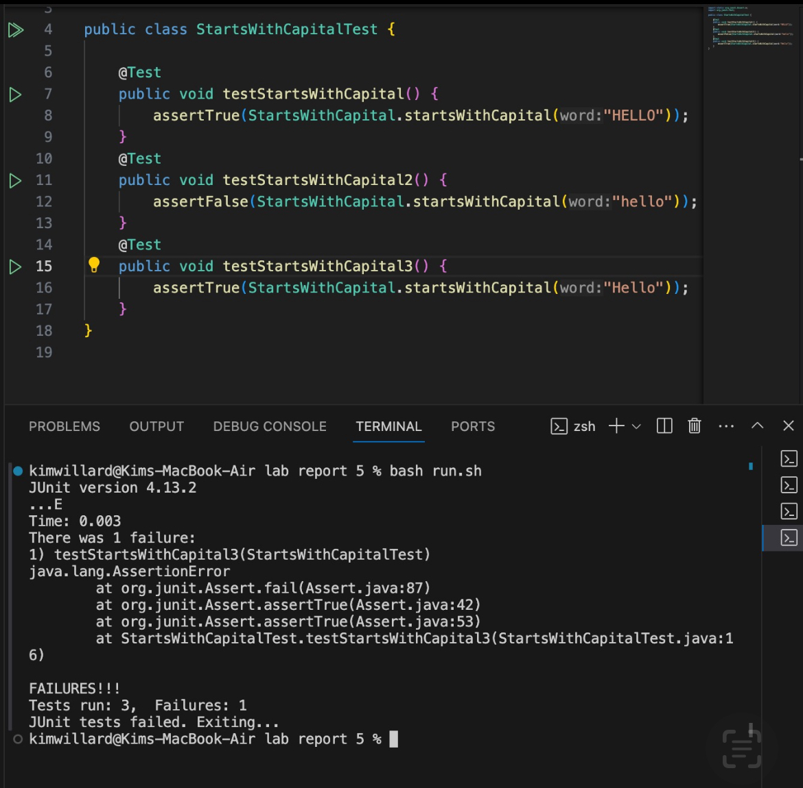
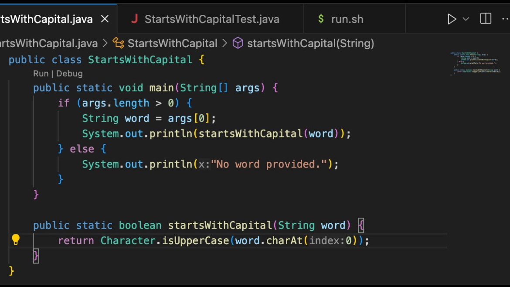

## Lab Report 5
Part 1

Student: Hi, I am coding a program that takes an argument and returns true if the
first character is an uppercase letter. I wrote some Junit tests to go along with it--
however, they aren't working completely correctly and I'm not sure why.

As you can see, the third test fails even though "Hello" does start with a capital
letter. I find it odd that test 1 still passed, so I'm wondering if maybe it only returns
true when the entire argument is uppercase.

TA: That could be a possibility. You could also consider if its possible that each
test is affecting the results of the next test if you have some sort of variable involved that
isn't resetting correctly. Are you sure that you're only testing the very first character to see if
it's capitalized? I would start there. Make some more JUnit tests.

Student: Ok, let me create some more JUnit tests that tests what characters are being tested.

These results are so helpful! It doesn't seem to matter what the the capitalization of index 0 is.
However, I can tell that each test is passed when index 1 is capital!. It seems like I mixed up index 0 and 1 again,
it's just a little confusing. Thank you for your help!
Before: 

After: 

Reflection: In labs in the last few weeks, I grew so much more comfortable working just form the command line
and not needing to rely on VS code anymore. Using vim and jdb is going to help me so much for coding in the future.
I also had never using bash before, and I think this makes it so much easier to compile and run code quickly.
